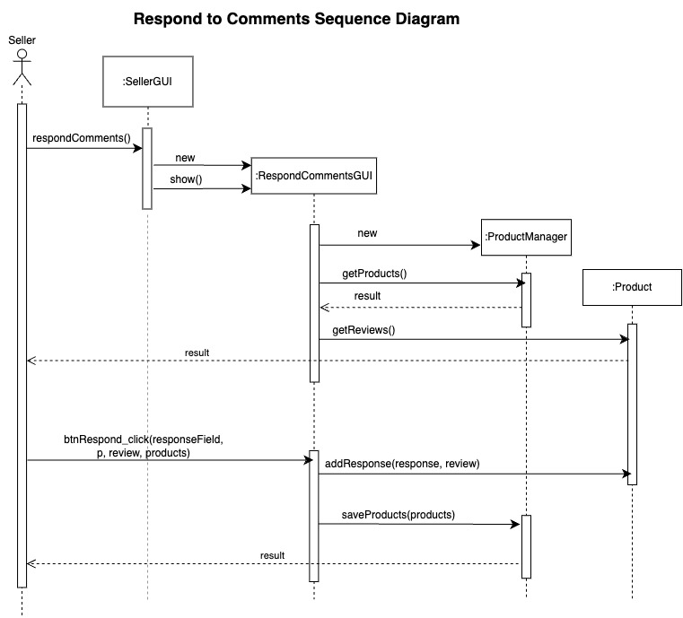

# MarketPlace System

## Description

- This project is a marketplace that facilitate trades between Buyers and Sellers. Different buyers can come to this platform to browse, purchase, and review products available for sale. Sellers are able to upload products to this platform, which is managed by a single platform seller. The reason for a single manager is to facilitate the sourcing of products and to provide a platform where different buyers can come together to interact.

## Use Case Diagrams

### Buyer Use Case

### Seller Use Case

## Sequence Diagrams

### Create Profile

### Modify Profile

### Delete Profile

### Browse Marketplace

### Buy Product

### Return Product

### Leave Review

### Upload Products

### Remove Products

### View Sales Statistics

### Respond to Comments

### Modify Products

## Class Diagrams

### Classes

### Relationship between Classes

