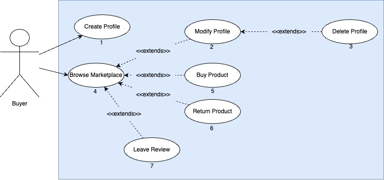

# MarketPlace System

## Description and Vision

- We believe our marketplace system helps facilitate trading strongly between buyers and sellers. Different buyers can come to this platform to create a profile, browse products available for sale, purchase products, and leave reviews for products. As for the sellers, we envisioned a single platform manager that interfaces with the many sellers who are able to upload products to the manager. This is essentially a Costco-like business model to facilitate the sourcing of products from different sellers and places, and enabling faster distribution to customers.

## Use Case Diagrams

### Buyer Use Case

### Seller Use Case

## Sequence Diagrams

### Create Profile

### Modify Profile

### Delete Profile

### Browse Marketplace

### Buy Product

### Return Product

### Leave Review

### Upload Products

### Remove Products

### View Sales Statistics

### Respond to Comments

### Modify Products

## Class Diagrams

### Classes

### Relationship between Classes

